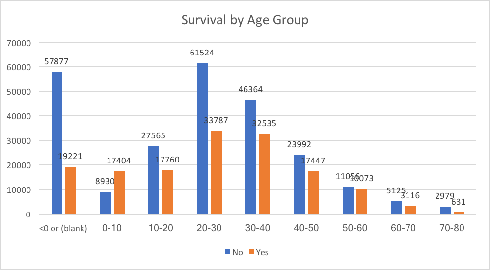
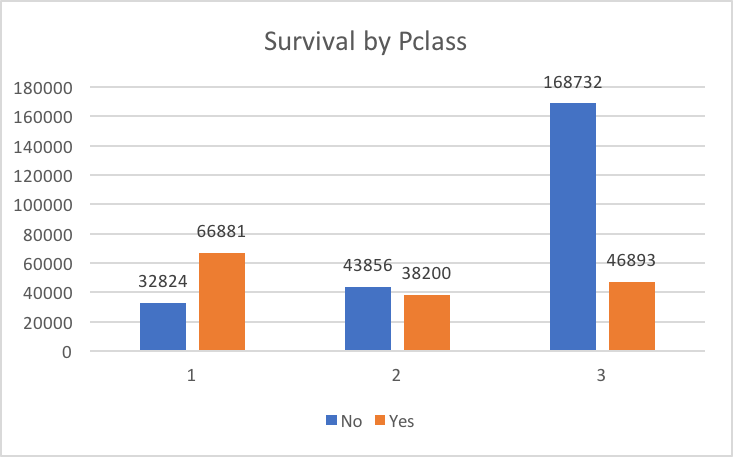
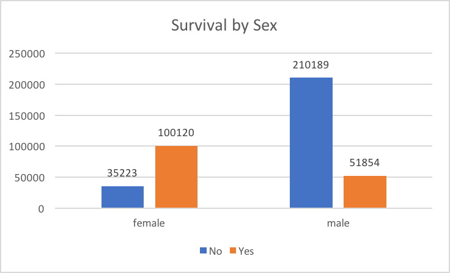
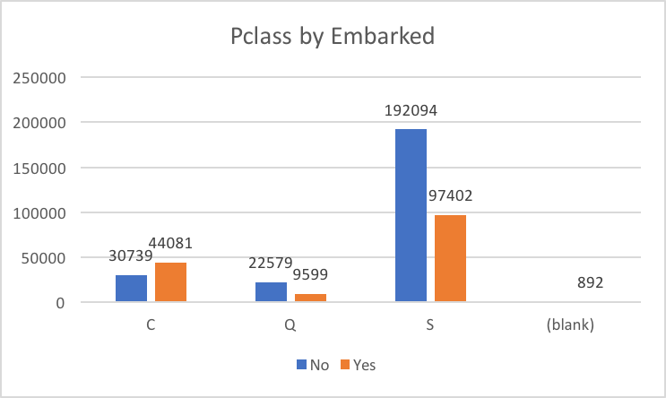
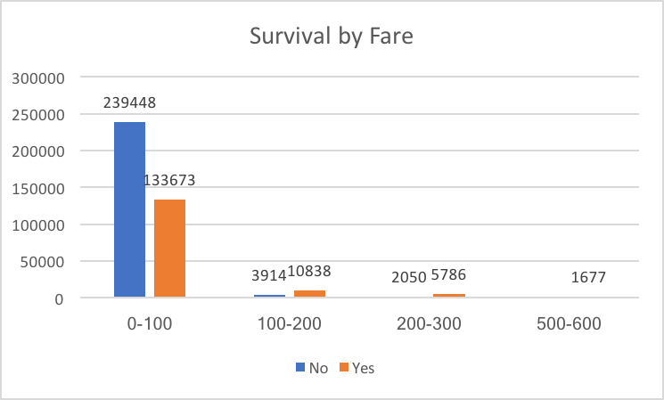
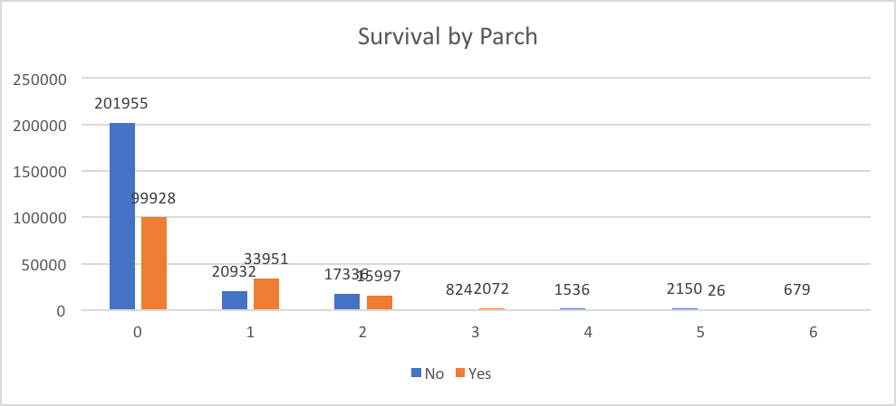
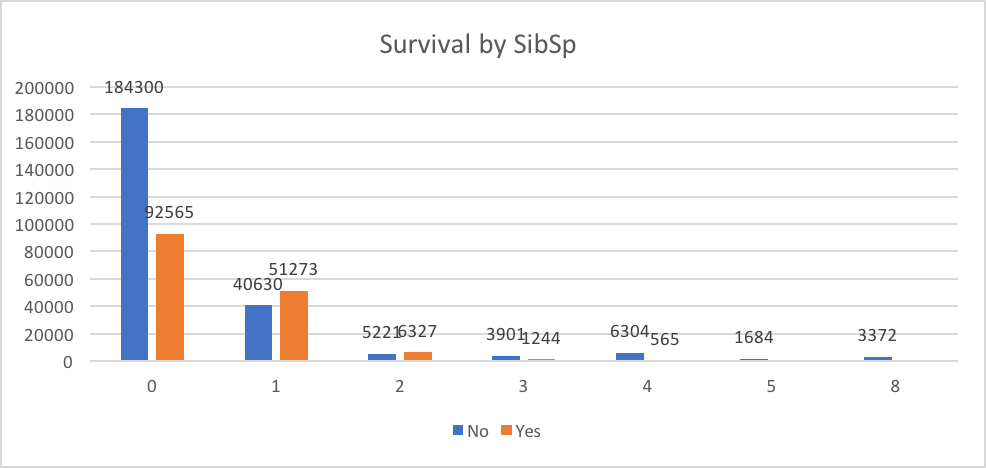

## Questions 4
### build at least two of {Naïve Bayes, Logistic Regression, random forests, support vector machines or neural networks using the libraries of Spark.MLLib only. 
Please refer to the code below.
### Explain your choice; 
The Random Forest classifier is chosen for the following reasons:

1. It has second best accuracy among all classifiers.
2. It provides the probability, which can be used for answer " what sorts of people were likely to survive "

### plot learning curves; 
### explain observed behavior; 
### investigate which features are most informative; 

As the baseline, the following features are chosen based on common sense ['Pclass','Sex','Age','SibSp','Parch','Fare','Embarked']. 

Then the individual features are removed to measure the (negative) impact to the prediction performance.

**Accuracy**|**Baseline**|**-'Pclass'**|**- 'Sex'**|**- 'Age'**|**-'SibSp'**|**-'Parch'**|**-'Fare'**|**-'Embarked'**
:-----:|:-----:|:-----:|:-----:|:-----:|:-----:|:-----:|:-----:|:-----:
NaiveBayes                    |0.72826087|0.710382514|0.646153846|0.674157303|0.683544304|0.67816092|0.803108808|0.709677419
LogisticRegression            |0.804347826|0.808743169|0.687179487|0.792134831|0.797468354|0.827586207|0.808290155|0.779569892
RandomForestClassifier        |0.831521739|0.825136612|0.733333333|0.814606742|0.816455696|0.844827586|0.808290155|0.790322581
MultilayerPerceptronClassifier|0.809782609|0.759562842|0.687179487|0.837078652|0.689873418|0.643678161|0.792746114|0.784946237

Based on the results above, below is the ranking of the most informative features's:

* Sex
* Age
* Pclass
* SibSp
* Embarked
* Parch
* Fare

### do at least one round of error analysis to maximize your chosen metric (F1, accuracy, weighted F1); 

The prediction accuracy using features: 

    Features: 'Cabin','Sex','Age','SibSp','Parch','Fare','Embarked'
    NaiveBayes                    	0.710382513661
    LogisticRegression            	0.808743169399
    RandomForestClassifier        	0.825136612022
    MultilayerPerceptronClassifier	0.75956284153

The replacement of Cablin with Pclass improves the 

    Features: 'Pclass','Sex','Age','SibSp','Parch','Fare','Embarked'
    NaiveBayes                    	0.728260869565
    LogisticRegression            	0.804347826087
    RandomForestClassifier        	0.83152173913
    MultilayerPerceptronClassifier	0.809782608696

### explain your choice of metric.
The accuracy is the number of correct predictions made divided by the total number of predictions made. It is chosen because it's a good performance indicator of the prediction and corralates well with the F1/weighted F1 score.

## Appendix
### a statistical summary of the original data

### a discussion of model convergence
### a learning curve visualization
### a summary of the compute requirements for processing the data.