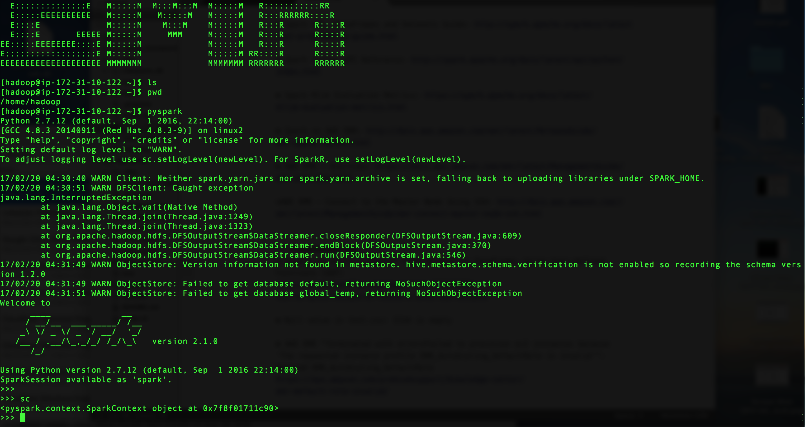
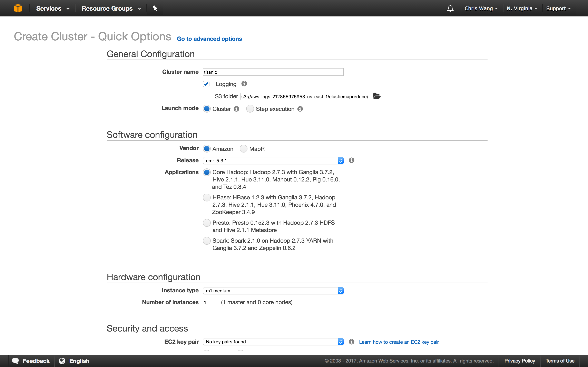
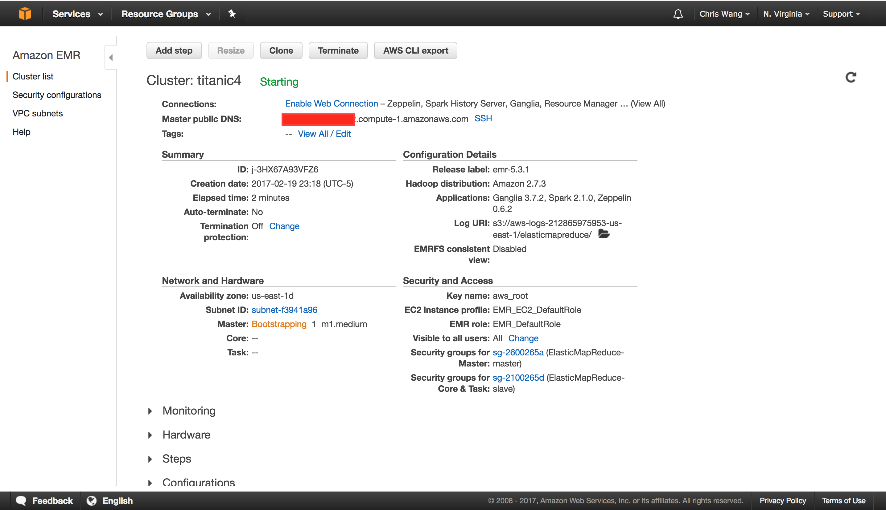
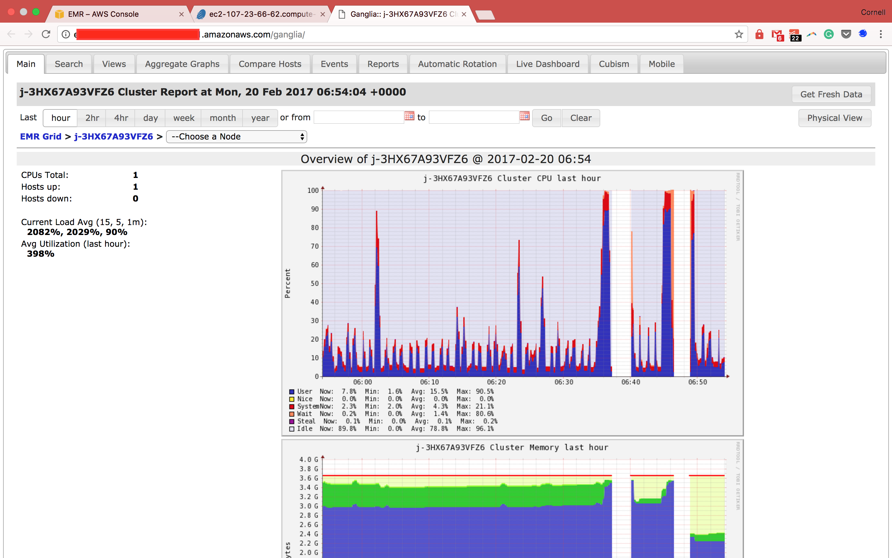

#  CS 5304 HW1 - Tier 2 Report
By Chris M. Wang (mw866@cornell.edu)

## Requirement 1
### A maximum 2-page addendum to the report will provide visual evidence that the student used Spark running on Amazon Web Services (AWS) to complete the project
Please refer to the __Addendum 1__ at the end of the report.

###  a summary stating the options for running Spark on AWS versus other cloud environments.

Some options for hosting Spark on cloud are summarized below:

Provider| ML Support | Starting $
---|--- | --- | --- 
AMS EMR| Spark, Hadoop, HBase, Presto|$0.26/hr
Microsoft Azure Machine Learning|Spark, MapReduce, HBase, R Server|$0.35/hr
DataBrick| Spark only|Free

### a discussion of the desirability for use of machine learning model types available in Spark.MLlib to complete the project.
The Spark.MLlib is much desired for machine learning despite the following shortcomings:

* Lack of granular visibility and control "inside" the machine learning models e.g. plotting of learning curves
* Use of User Defined Functions (UDF) is prone to errors and hard for troubleshooting.


## Requirement 2
### A maximum 1-page addendum to the report that analyzes the value of each “column” or feature of the data available in the Titanic data set.

For detailed analysis, please refer to the section of __"investigate which features are most informative"__ in the __Tier-1 Report__

In short...
* high-value features:  Sex, Age and Pclass.
* low-value features: SibSp, Embarked, Parch and Fare.
* irrelevant features: PassengerId and Ticket
* unknown: Cabin


## Addendum 1: Screenshots of Spark on AWS

			
